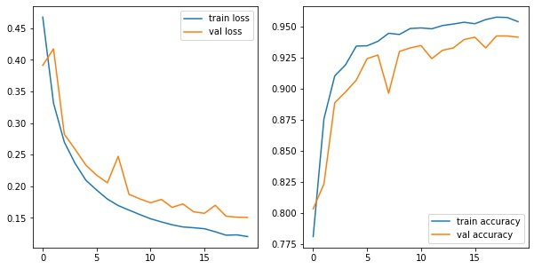
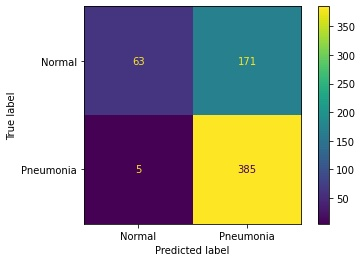
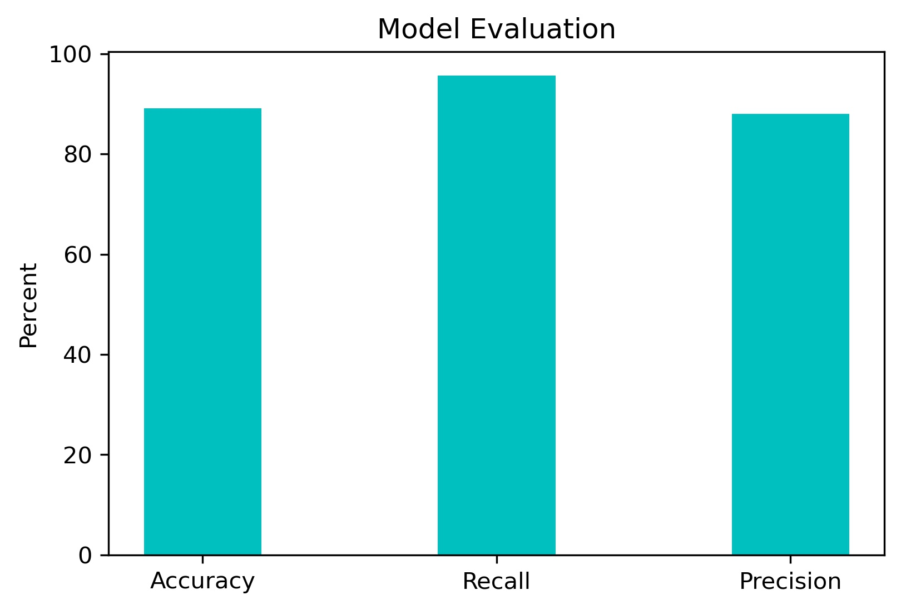

# Deep Learning Pneumonia Detection

**Authors**: Meir Alelov, Greg Burgess


## Overview
 
We have built a convolutional neural network model which accurately classifies pediatric chest X-ray images as having pneumonia or not. This model was trained on pediatric chest X-ray images and, through an iterative modeling approach, has achieved an overall accuracy of 89.1%, recall of 95.6%, and precision of 87.9%. This could be an important tool to reduce childhood mortality, especially in impoverished regions with less access to advanced healthcare systems.


## Business Problem

Worldwide, over 800,000 children under five die every year from pneumonia [source](https://data.unicef.org/topic/child-health/pneumonia/). Pediatric mortality rates are especially high in regions affected by poverty and inadequate access to health care. One factor causing this is that these regions have less access to rapid radiological interpretation of images, which could result in a delay of clinical care and poorer prognosis [source](https://www.cell.com/cell/fulltext/S0092-8674(18)30154-5).

We set out to determine whether we could use deep learning to quickly and accurately classify pneumonia in x-ray images. Information from a fast, automated deep learning classifier could assist clinicians in low-resource settings to make pneumonia diagnoses more quickly. Expediting diagnoses in these situations may result in a substantial reduction in childhood mortality from pneumonia.


## Data

Data for this investigation were originally acquired by Kermany and colleagues, and were available for public download within [Kaggle](https://www.kaggle.com/datasets/paultimothymooney/chest-xray-pneumonia).

These chest X-ray images were acquired at Guangzhou Women and Children’s Medical Center in Guangzhou, China as part of routine clinical care. 

Patients were aged between one and five years old. Our training set included 3875 pneumonia images and 1341 normal images, and the held out test set included 390 pneumonia images and 234 normal images.

Pneumonia is indicated by abnormal opacification in the x-ray image, compared to clearly visible vascular features in normal x-rays.


### Data Preparation

First, we downloaded data from Kaggle and unzipped into data directory. We chose not to use the images in the val directory, because that data only had 8 normal and 8 pneumonia images. Because of that, we intend to create our own validation set with a larger number of images.

We used ImageDataGenerator module in tensorflow to genreate batches of vectorized image data. Because we dropped the val directory, however, we created a new validation set using the validation_split option. 

Uniform image size was set to 128x128. We later use ImageDataGenerator to augment our training data set, by manipulating the original training images to provide additional training images after various manipulation techniques (shear, scale, shift, etc.). This was done in an attempt to make poorer quality training data so that the model would generalize to unseen data better.


## Methods

We evaluated and compared three different types of neural networks: simple models with one hidden layer, more advanced models with multiple hidden layers, and finally convolutional neural networks using layers of convolution filtering in addition to multiple hidden layers. 

When it comes to evaluating the models, we had two major concerns within this medical context. 

- First, we want our neural network to correctly identify true positive cases of pneumonia as often as possible. This is measured using a metric called “recall”.

- Second, we want to avoid mislabeling children who are negative for pneumonia, to preserve valuable medical resources for children in need. To do this, we maximized a metric called “precision”.


## Modeling and Results


### DummyClassifier

Our baseline classifier had an accuracy of 62.5%, recall of 100%, and precision of 62.5%.

### First simple model

Our first simple model only had 1 hidden layer, with a sigmoid activation function, and an 'SGD' optimizer. Every model in this notebook uses binary crossentropy as the loss function. 

The first simple model had a `val_accuracy` of 93.4%, `val_recall` of 98.2%, and `val_precision` of 93.3%.



Train and validation scores were both very high, suggesting that we may already have a highly accurate model!

We expected similarly high scores in the unseen test set as well. When scoring the model on the test set, however, the accuracy was 71.7%, recall was 98.7%, and precision was 69.2%. 

Unfortunately, model performance suffered on the unseen data. Our accuracy and precision are far worse on the test set than the validation set, even though both of those data sets were unseen during training!



This is a confusing situation (hence the confusion matrix). this discrepancy between performance on the test and validations set could indicate one of two things:

Perhaps the validation split was "lucky". Maybe, simply by chance, the ImageDataGenerator chose a split of validation images that were unusually accurate during the model evaluation.

- To check whether this might be true, we will use different validation sets by creating a cross-validation function.
That function will use the withhold different segments of the training data as validation sets, to see whether the original validation set was just lucky by comparison.
- If we get similar performance on different validation splits, it suggests that we're not getting this performance by chance.

Perhaps the images in the test set were more dissimilar from the train set than the validation images were.

- Stated differently, if images in the test directory were different (came from different x-ray machines or children of different ages) than images in the train directory, they would be less similar to the training data than our validation images were.
- To evaluate this possibility, we used the image manipulation functions within ImageDataGenerator to augment the training set with degraded copies of the original data. This will make the training data more variable, so as to make training harder, resulting in a more "fit" model.

### Cross-Validation

Turns out the average cv score was 93.5%, so the first stipulation is false, and we can assume that augmenting the data will solve this issue. 

### Augmented Data

The first simple model with augmented data had `val_accuracy` of 81.4%, `val_recall` of 90.9%, and `val_precision` of 85.1%. This is a significant improvement, so we decided to use only augmented data from this point on. 


### Multiple Hidden Layers

Now that that's out of the way, our first multilayer model had 3 hidden layers, all of which used relu as an activation function, as well as L2 (ridge) regularization. This model scored as follows: `val_accuracy`: 79.6%, `val_recall`: 95.1%, `val_precision`: 80.8%.

At this point, we want to maximize all these scores, so a convolutional neural net will allow for more complexity, potentially training the model better. 

### Convolutional Neural Network

Our first attempt at a CNN model included the same dense layers (with same regularization), same optimizer, but included 2 sets of Conv2D/MaxPooling2D layers before the hidden layers. This model scored as follows: val_accuracy: 92.8%, val_recall: 94.2%, val_precision: 96.1%. Accuracy and precision increased significantly, so we're on the right track. 


### Convolutional Neural Network (with Dropout Layers)

As a final attempt to reduce overfitting, we decided to take the above model and simply add dropout layers for more regularization. This final model scored as follows: `val_accuracy`: 91.4%, `val_recall`: 92.9%, `val_precision`: 95.4%. 


The metrics suffer slightly, and the model tested slightly worse on unseen data than did the previous model. This updated model has scores of: accuracy: 88.3%, recall: 94.4%, precision: 87.8%.


Importantly, when evaluated on the held out test images, the CNN model with dropout layers had more false negatives (children with pneumonia labeled as normal) compared to the CNN model without dropout layers. Given that minimizing these false negatives was important, we chose the original CNN model as our final model.


## Conclusions

Ultimately, our best neural network was a convolutional neural network with multiple hidden layers. This network has an overall accuracy of 89.1% for classifying unseen images as pneumonia versus normal. The recall for our final model was 95.6%, and the precision was 87.9%.



We were excited by the performance of our convolutional neural network, and feel that it could be very helpful to clinicians in regions affected by poverty and inadequate access to radiological experts. By helping to quickly identify children needing treatment for pneumonia, this tool may help save lives of children who would otherwise be vulnerable to this disease.

## Next Steps

If provided the opportunity to continue working on this project, we have plans to continue improving this product.

- Utilize additional imaging modalities (e.g., MR and CT)
- Additional acquisition types (slice planes)
- Use NLP to incorporate information from H&P
- Distinguish viral pneumonia from bacterial pneumonia, because they require different courses of care

## Repository Structure

Describe the structure of your repository and its contents, for example:

```
├── README.md					<- The top-level README for reviewers of this project
├── Deep_Learning_Pneumonia_Detection.ipynb	<- Narrative documentation of analysis in Jupyter notebook
├── Presentation.pdf				<- PDF version of project presentation
├── notebooks					<- versions of working notebooks
│   ├── greg_working_notebook.ipynb		<- jupyter notebook with initial simple models
│   ├── greg_working_notebook_multilayer.ipynb	<- jupyter notebook with multilayer models
│   ├── greg_working_notebook_cnn.ipynb		<- jupyter notebook with convolutional neural networks
│   └── meir_working_notebook.ipynb		<- jupyter notebook with cross-validation and plotting functions
├── data                                	<- Contains saved models (.h5) and model.history (.csv)
└── images                              	<- Both sourced externally and generated from code
```
